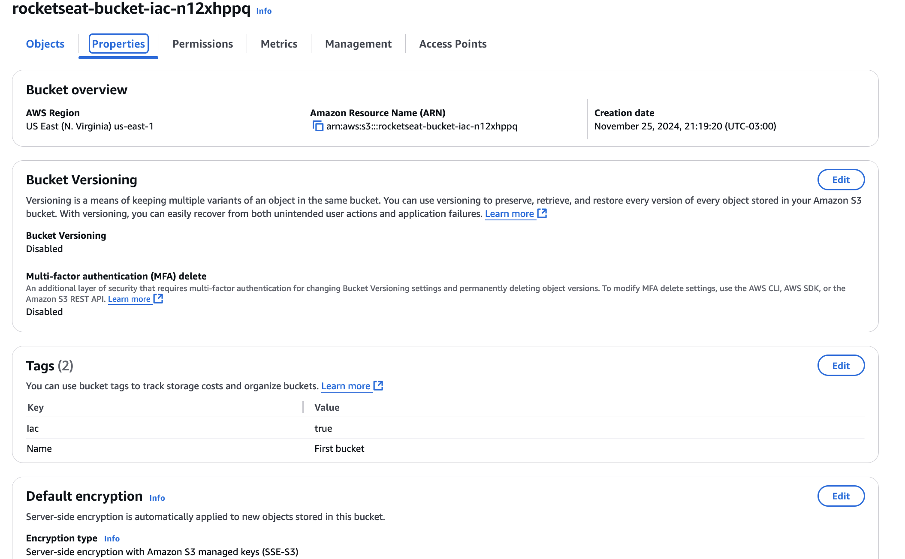

# Infrastructure as Code (IaC)

## Project description
The goal of this project is to create a simple infrastructure as code (IaC) using Terraform.

## Useful commands

- `terraform init`: Initialize a Terraform working director
- `terraform plan`: Show changes required by the current configuration
- `terraform apply`: Create or update infrastructure
- `terraform destroy`: Destroy Terraform-managed infrastructure
- `terraform show`: Show Terraform state or plan
- `terraform output`: Show output values from your Terraform state
- `terraform fmt`: Rewrites all Terraform configuration files to a canonical format
- `terraform validate`: Validates the Terraform files

## Environment

### Working on MacOS

- Install Terraform: `brew install terraform`
- Install tflint: `brew install tflint`
- Install aws cli: `brew install awscli`
- Install VS Code Terraform extension.

## Setting up AWS credentials

1. Access IAM Identity Center
2. Enable it in case it is not enabled
3. Edit settings summary accordingly
4. Set region
5. Create a user
6. Then go to your environment and start with the following commands:

```bash
aws configure sso
````

enter the SSO session name

in SSO start URL enter the AWS access Portal URL provided in the IAM Identity Center settings summary.

SSO region: us-west-1

Nothing in SSO registration scopes

7. Enter credentials in the browser
8. Create a permission set as AdministratorAccess
9. In AWS accounts add the account you want to use
10. Repeat ```aws configure sso```
11. Allow access and there will be a succeful message saying 

```bash
Request approved

AWS CLI has been given requested permissions
```

12. Set the CLI default client Region
13. CLI default output format can be empty for now

# S3 bucket creation with Terraform

1. Create a main.tf or resources.tf file 
2. Fill it with the corresponding code
3. Verify the code with ```terraform validate```
4. Use the ```terraform plan``` command to see the changes that Terraform will make to your infrastructure.
5. Execute the ```terraform apply``` command to apply the changes to your infrastructure.



# Best practices for Terraform

- Mark resources with tags like ```Iac = true```
- Make the AWS console read-only, so you are forced to use IaC to create or modify resources.

# Planning destruction

- Use the ```terraform plan -destroy``` command to see the changes that Terraform will make to your infrastructure.

# Destroying a resource

- Use the ```terraform destroy``` command to destroy the resources created by Terraform. This command will prompt you for confirmation before destroying the resources. If you want to skip the confirmation prompt, you can use the ```-auto-approve``` flag. For example:

```bash
terraform destroy -auto-approve
```

# How does Terraform work?

## State

Any ```plan``` or ```apply``` command saves the current state of your infrastructure to the Terraform state file, which is named ```terraform.tfstate``` by default. This state file is extremely important; it maps various resource metadata to actual resource IDs so that Terraform knows what it is managing. This is why it is so important to keep your state file in a safe and accessible location.

### ```terraform.tfstate``` file

The ```terraform.tfstate``` file is the default state file used by Terraform. It is created in the same directory as your Terraform configuration files. This file contains the current state of your infrastructure, including the IDs of any resources that Terraform has created. It is a JSON file that can be read and modified by humans, but it is generally not recommended to do so.

### ```terraform.tfstate.backup``` file

The ```terraform.tfstate.backup``` file is a backup of the ```terraform.tfstate``` file. It is created automatically by Terraform when you run a ```plan``` or ```apply``` command. This file is used to restore the state of your infrastructure in case the ```terraform.tfstate``` file becomes corrupted or lost. It is a good idea to keep this file in a safe place, such as a version control system or a secure backup location.

# Terraform facts

- If the resources was changed outside of Terraform, Terraform will not be able to manage it anymore.
- If a tag is changed and becomes null, Terraform will try to delete it.

# Workspaces

By default, Terraform uses a single workspace called ```default```. This workspace is created automatically when you initialize a new Terraform project. You can create additional workspaces to manage different environments or configurations. For example, you might have a workspace for your development environment and another workspace for your production environment.

## Workspaces and state

Each workspace has its own state file. This means that you can have different resources in different workspaces. For example, you might have a resource in your development workspace that is not present in your production workspace. When you switch between workspaces, Terraform will automatically load the state file for the current workspace.

Workspaces are saved in the ```terraform.tfstate``` file. When you run a ```plan``` or ```apply``` command, Terraform will compare the current state of your infrastructure to the desired state defined in your Terraform configuration files. If there are any differences, Terraform will create a plan to bring your infrastructure into the desired state.

## Useful commands

- ```terraform workspace new <workspace_name>```: Create a new workspace
- ```terraform workspace list```: List all workspaces
- ```terraform workspace show```: Show the current workspace
- ```terraform workspace select <workspace_name>```: Switch to a different workspace
- ```terraform workspace delete <workspace_name>```: Delete a workspace

